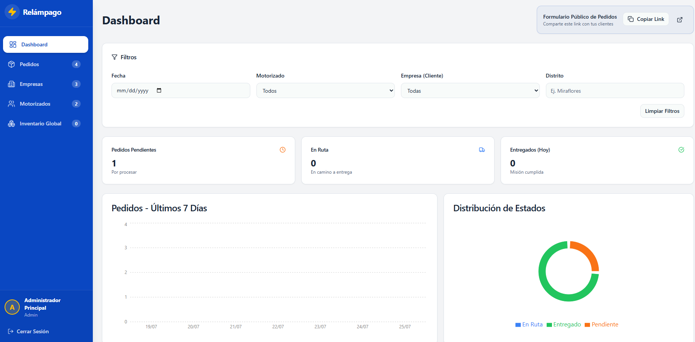
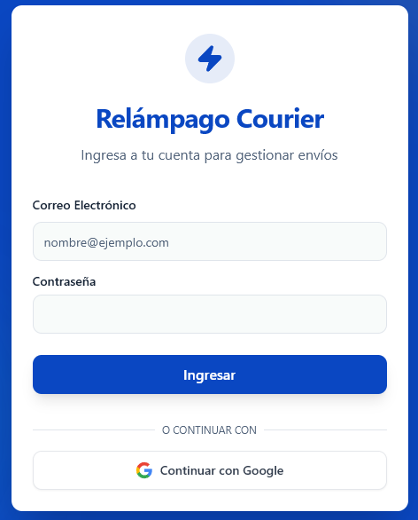

# Relampago Courier

Relampago Courier is a delivery operations dashboard built for small logistics teams that need to intake orders, assign couriers, track delivery status, manage client inventory, and collect proof of delivery from the field.

This repository is presented as a portfolio project: it shows a full React + TypeScript application connected to Supabase, with role-based user flows for administrators, staff, couriers, and clients.

## Screenshots

### Admin dashboard



### Login



## What recruiters should notice

- **End-to-end product thinking:** the app covers the operational loop from public order intake to courier assignment, delivery confirmation, and inventory visibility.
- **Real backend integration:** Supabase Auth, database-backed workflows, role-aware access patterns, and storage-backed delivery proof uploads are part of the implementation.
- **Role-based UX:** different users see different workflows, keeping admin, courier, and client experiences focused.
- **Data-heavy UI:** dashboards, filters, sortable tables, inline editing, bulk assignment, and charts support day-to-day logistics work.
- **Modern frontend stack:** React, TypeScript, Vite, Tailwind CSS, Radix UI primitives, React Hook Form, Zod, Recharts, and Supabase JS.

## Product overview

Relampago Courier helps a delivery company coordinate orders between commercial clients, internal operators, and couriers.

Core workflows include:

- public order submission through `/pedido-express`
- admin/staff dashboard with delivery status metrics and filters
- order management with sorting, filtering, inline edits, payment details, tariffs, and bulk courier assignment
- courier mobile workflow for viewing assigned deliveries, starting routes, confirming delivery, and uploading photo proof
- company/client management with contact and logistics details
- stock management for client inventory
- protected routes based on user role

## User roles

| Role | Main capabilities |
| --- | --- |
| Admin | Dashboard, orders, companies, couriers, global stock, assignment, reporting views |
| Staff | Dashboard, orders, companies, couriers, day-to-day operations |
| Courier | Assigned deliveries, route status updates, delivery proof upload |
| Client | Client-facing stock visibility |

## Tech stack

- **Frontend:** React 19, TypeScript, Vite
- **Routing:** React Router
- **Auth and data:** Supabase Auth, Supabase Database, Supabase Storage
- **Forms and validation:** React Hook Form, Zod
- **UI:** Tailwind CSS, Radix UI primitives, Lucide icons
- **Charts:** Recharts
- **Tooling:** ESLint, TypeScript project references, Vercel config

## Architecture at a glance

```text
src/
  components/       Shared layout, auth wrapper, protected routes, order form, UI primitives
  pages/            Role-based application screens
  lib/              Supabase client and shared utilities
  types/            Typed Supabase data model
```

Supabase tables represented in the typed model include:

- `profiles`
- `companies`
- `orders`
- `order_items`
- `stock`
- `deliveries`

## Getting started

### Prerequisites

- Node.js 20+
- npm
- a Supabase project

### Installation

```bash
npm install
```

### Environment variables

Create a `.env` file from the example:

```bash
cp .env.example .env
```

Then configure:

```bash
VITE_SUPABASE_URL=your-supabase-project-url
VITE_SUPABASE_ANON_KEY=your-supabase-anon-key
```

### Run locally

```bash
npm run dev
```

### Build

```bash
npm run build
```

### Lint

```bash
npm run lint
```

## Supabase setup notes

This app expects the Supabase project to include the tables and access policies used by the React client, including profiles, companies, orders, deliveries, and stock.

For delivery proof uploads, create a Supabase Storage bucket named `proofs` and configure access policies appropriate for your deployment.

## Portfolio context

I built this project to demonstrate practical frontend engineering in a business workflow: translating logistics operations into a typed, role-aware web application with real authentication, database integration, and field-worker interactions.

The strongest parts of the project are the operational UI patterns: dense tables, filtered dashboards, bulk updates, route-specific courier views, public intake, and proof-of-delivery handling.
